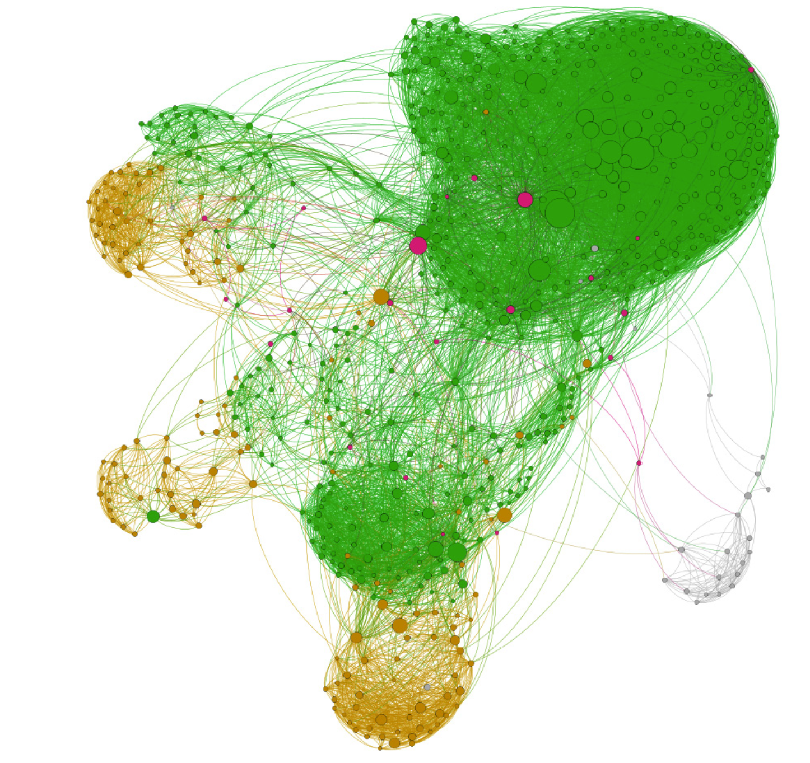
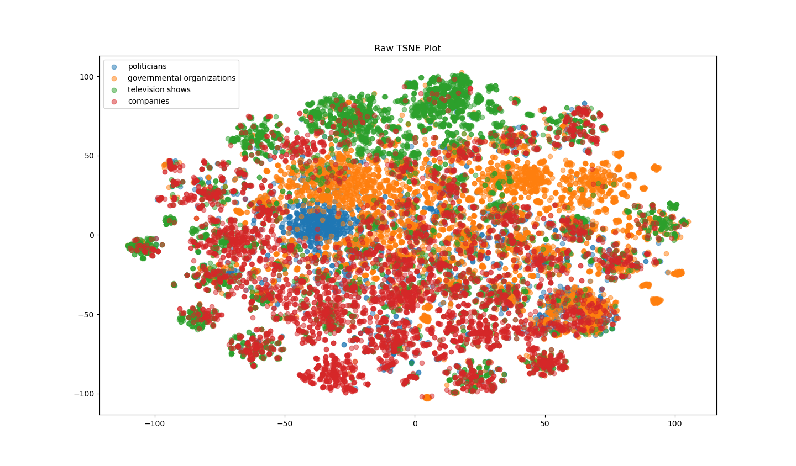

# Multi-Layer Graph Neural Network For Categorisation of Facebook Large Page-Page Network Dataset
Course: COMP3710 Pattern Recognition
Author: Liam Mulhern (S4742847)
Date: 26/10/2024

## Project Specification

Creates a multi-layer graph neural network (GNN) model for semi supervised multi-class node classification using Facebook Large Page-Page Network dataset with 80% Accuracy. This report includes TSNE and UMAP embeddings plot before and after model training providing a brief interpretation and discussion of results.

## Dependencies

- `python 3.11`
- `pytorch 2.5`
- `matplotlib`
- `numpy`
- `scipy`
- `networkx`

## Files

- `dataset.py`: Contains the data loader for loading and preprocessing the Facebook Large Page-Page (FLPP) Network dataset.
- `main.py`: Entry point for GNN classification with CLI arguments.
- `modules.py`: Contains the source code for the GNN model components.
- `train.py`: Contains the source code for training, validating, testing and saving the model. The model is imported from “modules.py” and the data loader is imported from “dataset.py”. Losses and metrics are plotted during training.
- `predict.py`: Runs inference on the trained GNN classification model. Prints out results and provides visualisations of TSNE embeddings.
- `utils.py`: Utility functions used for model implementation.

### Auxiliary Files

- `runner.sh`: SLURM shell script for training model
- `tests.py`: Unit tests for python files
- `gnn_classifier.csv`: Output csv at each epoch of model training

## Execution

> [!IMPORTANT]
> It is recommended that a python environment is utilsed for managing dependencies such a conda.

For help, execute the following shell command,

```bash
conda activate torch

python main.py --help
```

# Discussion

## Dataset

The [Facebook Large Page-Page Network](https://snap.stanford.edu/data/facebook-large-page-page-network.html) dataset is utilised, where nodes represent official Facebook pages while the links are mutual likes between sites. The sites are catergorised into:
1. Politicians
2. Governmental Organizations
3. Television Chows
4. Companies

The dataset was pre-processed into a 3 numpy arrays:
- edges: The undirected graph connections between nodes in the dataset formatted as tuples from the start node to the end node.
- features: The features of each of the nodes stored in a 128 dimensions vector created from textual descriptions written by the owners of these pages.
- targets: The categorisation target of each node.
The dataset has 22470 nodes with a 128 dimension feature set,  sourced from [Graph Mining Datasets](https://graphmining.ai/datasets/ptg/facebook.npz).

The network is visually represented as the following graph where colour represents the category and size reperesents the degree of the node.

- Green: Companies
- Yellow: Governmental Organizations
- Magenta: Politicians
- Grey: Television Shows



## Model


## Training Hyperparameters

- Learning Rate: 1e-3
- Epochs: 100
- Batch Size: 200
- Optimisation Strategy: Adaptive Moment Estimation (Adam)
- Loss Type: Cross Entropy

## Results




## Conclusion


## References

